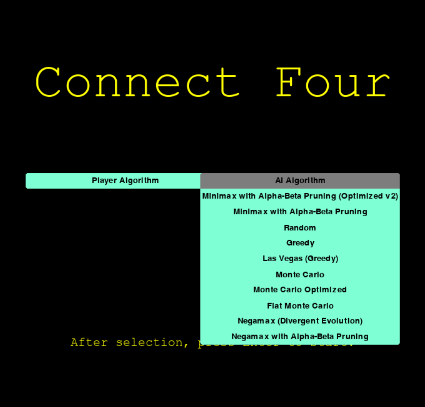
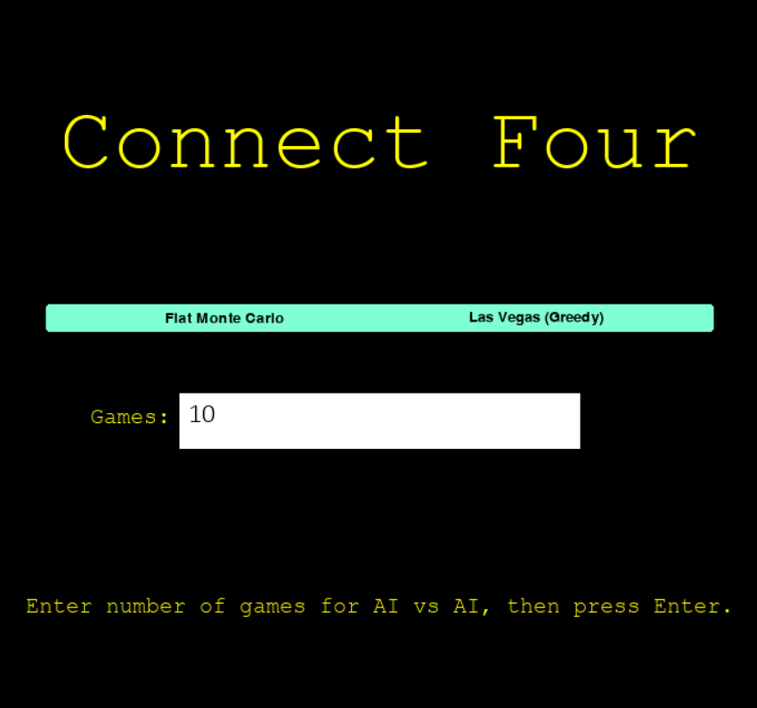
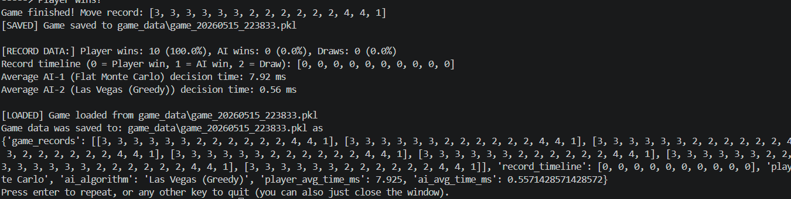

# Connect Four AI
NOTE: Before running the project, there are certain requirements you need (in requirements.txt).
Install them with "pip install -r requirements.txt" in your terminal.

To run the code, enter "python .\ConnectFourGame.py" in your terminal.
You will a menu that looks like this:

Click the drop-down menus to select your desired algorithm. If you're not playing the game yourself (Human), you will be prompted to enter the number of games to simulate in the text box.

Final data is printed in the terminal.
